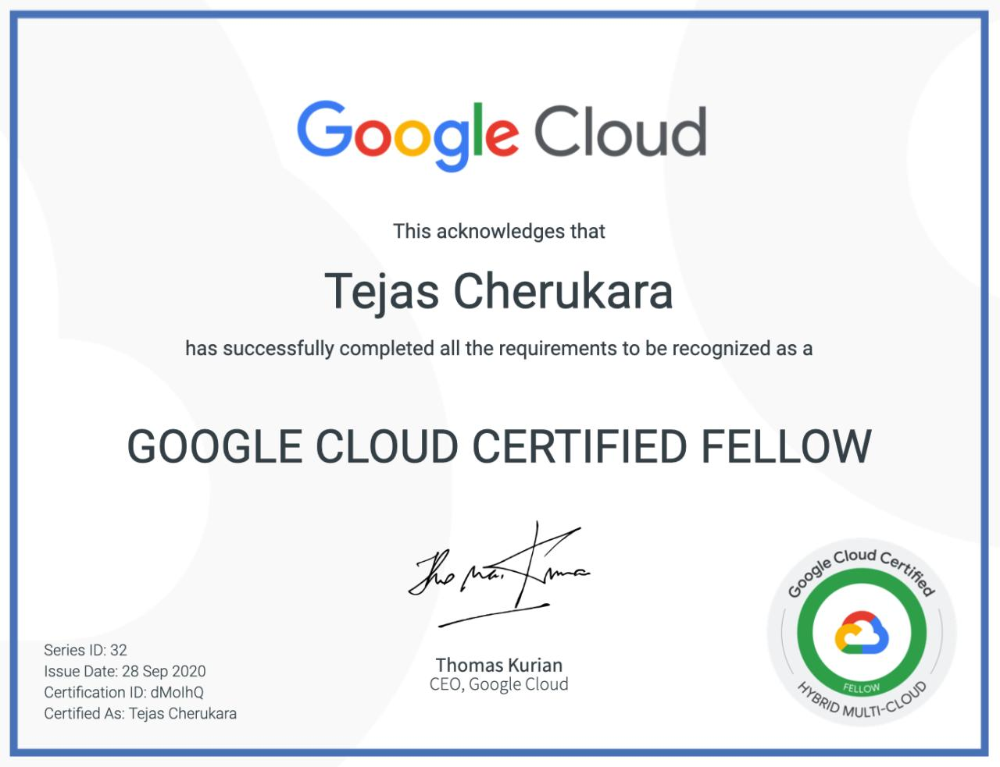
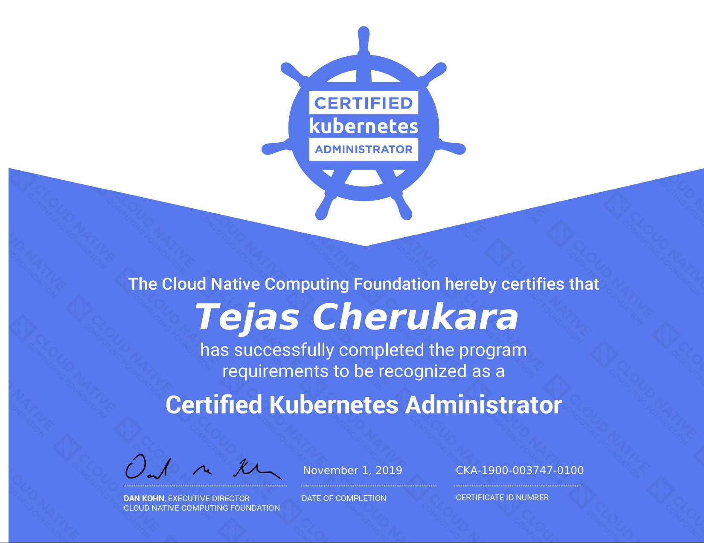
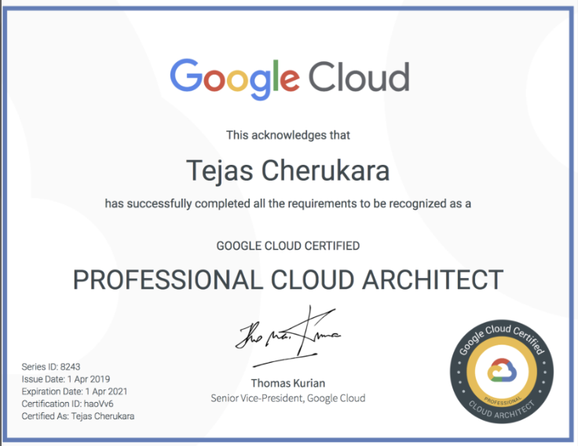
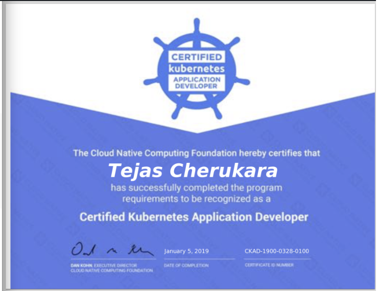

Selected cloud and cloud-native credentials earned across platform engineering, application development, architecture, and hybrid multi-cloud leadership.

---

<h3 id="gcp-certified-fellow">Google Cloud Certified Fellow</h3>

Options:

* **`--provider`** Google Cloud
* **`--specialty`** Hybrid Multi-Cloud
* **`--date`** 28 September 2020

**What this demonstrates:** I can lead enterprise hybrid and multi-cloud adoption with Anthos—designing solutions that modernize existing applications, build new cloud-native services, and run them securely across environments. It also reflects the technical leadership and industry practices needed to guide complex cloud transformation.

---

<h3 id="certified-kubernetes-administrator">Certified Kubernetes Administrator</h3>

Options:

* **`--provider`** Cloud Native Computing Foundation
* **`--specialty`** Kubernetes administration
* **`--date`** 1 November 2019

**What this demonstrates:** I can install, configure, operate, and troubleshoot production-grade Kubernetes clusters. That includes cluster lifecycle and high availability, RBAC, workloads and scheduling, services and networking, persistent storage, monitoring, and command-line incident resolution.

---

<h3 id="professional-cloud-architect">Google Cloud Certified Professional Cloud Architect</h3>

Options:

* **`--provider`** Google Cloud
* **`--specialty`** Cloud architecture
* **`--date`** 1 April 2019
* **`--original-expiry`** 1 April 2021

**What this demonstrates:** I can turn business objectives into robust, secure, scalable, cost-effective, and highly available Google Cloud architectures. The scope spans enterprise cloud strategy, solution design, migration across legacy, hybrid, and multicloud environments, infrastructure provisioning, security and compliance, implementation leadership, optimization, and operational excellence.

---

<h3 id="certified-kubernetes-application-developer">Certified Kubernetes Application Developer</h3>

Options:

* **`--provider`** Cloud Native Computing Foundation
* **`--specialty`** Kubernetes application development
* **`--date`** 5 January 2019

**What this demonstrates:** I can design, build, configure, expose, observe, and troubleshoot scalable cloud-native applications on Kubernetes. That includes defining application resources, working with OCI images and core Kubernetes primitives, deployment, configuration and security, services and networking, and application maintenance.

