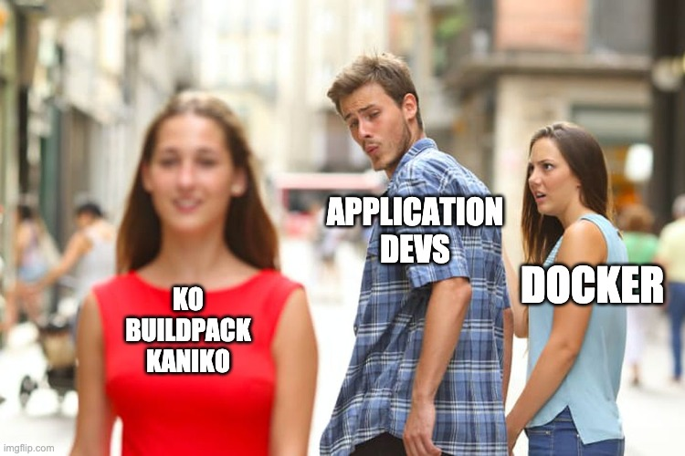
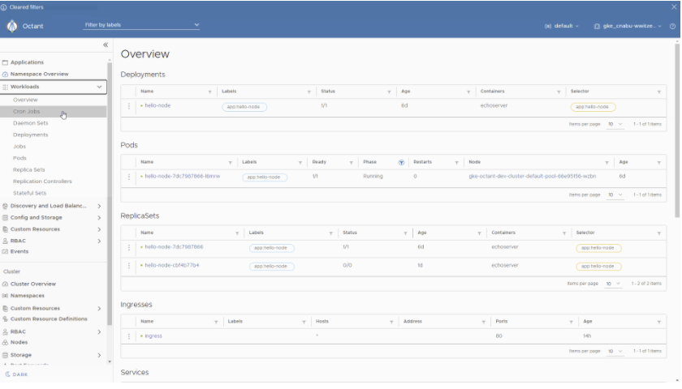

What does it mean for an application to be production-ready? Thankfully, industry leaders a lot smarter than me have given this a lot of thought!

If you haven't come across these resources yet, it is recommended  to go through them before reading this post:

- 📹 [Building Production-Ready Application][production-ready-talk] by Michael Kehoe
- 📕 [Production-Ready Microservices][production-readiness-book] by Susan J. Fowler

There are eight fundamental tenets of production readiness highlighted in these resources:

- 🔗 Stability
- 🎯 Reliability
- 🥁 Performance
- 📈 Scalability
- ✂️ Fault Tolerance
- 💥 Disaster Recovery
- 🔍 Monitoring
- 📕 Documentation

As technology evolves, several tools have emerged which helps achieve the tenets of production readiness mentioned above. This series of blog posts will be exploring the different cloud-native tools which help implement these principles.

**DISCLAIMER** The tools mentioned in this blog are just examples of tools available and might not be the best suited for your use case. The blog can serve as a starting point to research the most appropriate tools for your ecosystem.

### Assumptions

In this series of posts, I'll be exploring applications that are:

- Running in Kubernetes
- Part of the [CNCF Landscape][cncf-landspace]

---

## Principles

Stability and Reliability are the first two production readiness principles mentioned in the book.

> Stability: Development, deployment and adoption of new technologies do not give rise to instability across the larger microservice ecosystem. Susan J. Fowler

> Reliability: One that can be trusted by other microservices and by the overall system. Susan J. Fowler

These principles ensure that applications:

- have standardized development, testing and debugging cycles
- are build and packaged in a standardized and automated fashion
- has stable and reliable routing and discovery.

## Demo

Demos of tools are in the following repo:

[DEMO REPO](https://github.com/spacetj/production-readiness/tree/main/01-stability-reliability)

All commands have been abstracted into `make` targets to get up and running quickly.

---

## Build and Packaging

Ever since the introduction of Dockerfiles, it works on my machine is no longer an excuse for my crappy code. Since its initial introduction, many tools have been created to help developers get up and running with containers quicker:

### Kaniko

|                   |                       |
| ----------------- | --------------------- |
| **Open Source**   | [Repo][kaniko] ✅      |
| **Maintained By** | Google                |
| **First Release** | 18 May 2018           |
| **Demo**          | [kaniko][kaniko-demo] |

Dockers cooler, faster (when cached), and younger cousin, Kaniko is a tool for building container images from a Dockerfile without requiring a Docker daemon. Kaniko executes each command in userspace, enabling building container images in environments that can't easily or securely run a Docker daemon, such as a Kubernetes cluster. Kaniko can also be used to speed up builds by caching image layers.

### buildpacks

|                   |                   |
| ----------------- | ----------------- |
| **Open Source**   | [Repo][pack] ✅    |
| **Maintained By** | CNCF / Buildpack  |
| **First Release** | 21 Aug 2018       |
| **Demo**          | [pack][pack-demo] |

Buildpacks are like the guy friends your crush keeps telling you not to worry about. Buildpack can build images without a Dockerfile. It uses auto-detection instead. It tests groups of buildpacks against your source code, and the first group that fits your source code will become the selected set of buildpacks. Criteria are specific to each buildpack – for instance, an NPM buildpack looks for a package.json, and a Go buildpack looks for Go source files, etc.

### ko

|                   |               |
| ----------------- | ------------- |
| **Open Source**   | [Repo][ko] ✅  |
| **Maintained By** | Google        |
| **First Release** | 22 Mar 2019   |
| **Demo**          | [ko][ko-demo] |

Quick and easy container building for Golang applications without Dockerfiles or docker. `ko` executes `go build` on your local machine, thus not requiring docker to be installed. It can also populate Kubernetes manifests with image references.

ko does the following:

- Download a base image from a container registry
- Statically compile your Go binary
- Create a new container image layer with the Go binary
- Append that layer to the base image to create a new image
- Push the new image to the remote container registry
- Replaces your `image:` references in YAML automatically with the image it builds

### Helm 

|                   |                   |
| ----------------- | ----------------- |
| **Open Source**   | [Repo][helm] ✅    |
| **Maintained By** | CNCF / Helm       |
| **First Release** | November 2015     |
| **Demo**          | [helm][helm-demo] |

Ever wanted to use YAML as a programming language? Well, you still can't. But this might be the next best thing. Helm uses charts, a collection of files that describe a related set of Kubernetes resources. Charts are created as files laid out in a particular directory tree. They can be packaged into versioned archives to be deployed. Helm uses Sprig template library to help template the YAML files, and developers can define values in single or multiple value files.

### Tanka

|                   |                     |
| ----------------- | ------------------- |
| **Open Source**   | [Repo][tanka] ✅     |
| **Maintained By** | Grafana             |
| **First Release** | 31 Jul 2019         |
| **Demo**          | [tanka][tanka-demo] |

Inspired by the Jsonnet language, Grafana Tanka is a configuration utility that helps create Kube manifests. Like ksonnet (now deprecated), Tanka maintains the Kubernetes jsonnet library helping create DRY manifests and allows the definition of Kubernetes resources to be more concise than YAML.

### Kustomize

|                   |                     |
| ----------------- | ------------------- |
| **Open Source**   | [Repo][kustomize] ✅ |
| **Maintained By** | CNCF / Kubernetes   |
| **First Release** | 22 May 2018         |

Available as standalone CLI tools and part of `kubectl`, `kustomize` allows for template-free YAML manipulations. It reads in raw Kube manifest to add, remove or update configuration options through patches. Widely used for its ability to generate secrets and config maps from files.

---

## Local Testing
 
With the mass adoption of Kubernetes came the influx of tools that enable creating local Kubernetes clusters.

### Kind

|                   |                   |
| ----------------- | ----------------- |
| **Open Source**   | [Repo][kind] ✅    |
| **Maintained By** | CNCF / Kubernetes |
| **First Release** | 29 Nov 2018       |
| **Demo**          | [kind][kind-demo] |
 
Why just run containers when you can run containers inside containers which orchestrates other containers? `kind` is a tool for running local Kubernetes clusters using Docker container nodes. `kind` was primarily designed for testing Kubernetes itself but can be used for local development or CI.

---

## Dev Experience

Did you know that `kubectl` has close to 300 different variations of commands? I have no idea if that's true or what the real number is, but I bet you believed it for a second! Such is the complexity of the tooling. Many tools exist which helps developers visually understand Kubernetes resources and help them get up and running quicker:

### Skaffold

|                   |                           |
| ----------------- | ------------------------- |
| **Open Source**   | [Repo][skaffold] ✅        |
| **Maintained By** | Google                    |
| **First Release** | 6 Mar 2018                |
| **Demo**          | [skaffold][skaffold-demo] |

Skaffold handles the workflow for building, pushing and deploying your application, allowing devs to get their apps up and running quickly in a Kube cluster. The hot reload capability enables devs to focus on iterating your application locally while Skaffold continuously deploys to your local or remote Kubernetes cluster. I highly advise against hot reloading and deploying apps to the production cluster, had to put it in here just in case 😱.

### Octant

|                   |                       |
| ----------------- | --------------------- |
| **Open Source**   | [Repo][octant] ✅      |
| **Maintained By** | VMWare                |
| **First Release** | 20 Nov 2018           |
| **Demo**          | [octant][octant-demo] |

A UI for developers which helps developers understand the Kubernetes resources deployed in a cluster. Allows for easy navigation of cluster and resources management. The pluggable nature of the UI makes it ideal for writing devex extensions.

---

### Continuous Delivery

### ArgoCD

|                   |                       |
| ----------------- | --------------------- |
| **Open Source**   | [Repo][argocd] ✅      |
| **Maintained By** | CNCF                  |
| **First Release** | 13 Mar 2018           |
| **Demo**          | [argocd][argocd-demo] |

Bunch of buzz words coming through:

Declarative, GitOps continuous delivery tool for Kubernetes.

Enables gitops for Kube manifests, which translates to using Git repositories as the source of truth for defining the desired application state. To specify multiple environments for a service, `ApplicationSet` controller must also be installed. More details on getting started can be found in the [demo repo][argocd-demo].

## Conclusion

This blog presents a high-level summary of tools and their ability to build stable and reliable applications. As demonstrated, each new tool builds upon the last one to reduce complexity, improve developer experience and decrease time to setup.

Are there technologies that you've come across that isn't mentioned here? Reach out and let me know in the comments.

The following post will explore the different cloud native tooling that helps achieve the scalability and performance principles of production-ready microservices.

<!-- Links  -->

[production-readiness-book]: https://www.amazon.com.au/Production-Ready-Microservices-Standardized-Engineering-Organization/dp/1491965975/ref=asc_df_1491965975/?tag=googleshopdsk-22&linkCode=df0&hvadid=341791741598&hvpos=&hvnetw=g&hvrand=11583469740343046994&hvpone=&hvptwo=&hvqmt=&hvdev=c&hvdvcmdl=&hvlocint=&hvlocphy=9071462&hvtargid=pla-504426002607&psc=1

[production-ready-talk]: https://www.infoq.com/presentations/production-ready-applications/

[cncf-landspace]: https://landscape.cncf.io/

[kaniko]: https://github.com/GoogleContainerTools/kaniko

[kaniko-demo]: https://github.com/spacetj/production-readiness/tree/main/01-stability-reliability#kaniko

[pack]: https://github.com/buildpacks/pack

[pack-demo]: https://github.com/spacetj/production-readiness/tree/main/01-stability-reliability#kaniko

[kind]: https://kind.sigs.k8s.io/docs/user/quick-start/

[kind-demo]: https://github.com/spacetj/production-readiness/tree/main/01-stability-reliability#kind-kubernetes-in-docker

[helm]: https://github.com/helm/helm

[helm-demo]: https://github.com/spacetj/production-readiness/tree/main/01-stability-reliability#helm

[tanka]: https://github.com/grafana/tanka

[tanka-demo]: https://github.com/spacetj/production-readiness/tree/main/01-stability-reliability#tanka

[ko]: https://github.com/google/ko

[ko-demo]: https://github.com/spacetj/production-readiness/tree/main/01-stability-reliability#ko

[ko-deploy-demo]: https://github.com/spacetj/production-readiness/tree/main/01-stability-reliability#ko-1

[skaffold]: https://github.com/GoogleContainerTools/skaffold

[skaffold-demo]: https://github.com/spacetj/production-readiness/tree/main/01-stability-reliability#skaffold

[octant]: https://github.com/vmware-tanzu/octant

[octant-demo]: https://github.com/spacetj/production-readiness/tree/main/01-stability-reliability#skaffold

[argocd]: https://github.com/argoproj/argo-cd

[argocd-demo]: https://github.com/spacetj/production-readiness/tree/main/01-stability-reliability#skaffold

[kustomize]: https://github.com/kubernetes-sigs/kustomize
